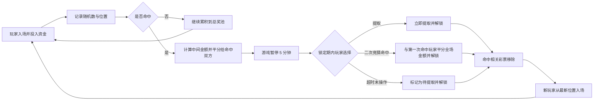

# 摆火车游戏

区块链公平福利彩票游戏。

## 游戏参数

每轮游戏可配置以下参数：

1. 随机数范围：默认 0～99999
2. 费率：默认 0.1%
3. 初始参与金额：默认 1U

## 核心规则

1. 玩家点击 `play` 按钮参与游戏后，合约会自动生成一个 NFT，NFT 内包含参与顺序与生成的随机数。
2. 当玩家新生成的随机数命中列表中的任意已存在随机数时，玩家与被命中玩家将平分两者之间的所有参与金额（包含双方自身金额）。
3. 每次参与金额会随参与人数增加而提高（见 1️⃣）。
4. 所有已参与玩家均可选择撤回资金；可撤回比例会随玩家顺序号增大而降低（见 2️⃣）。
5. 玩家撤回后，未撤回部分仍留在奖池中，且该彩票位置继续被占用。

## 额外机制

1. 每次有玩家命中后，游戏将暂停，并为该命中玩家提供 5 分钟操作时间。
2. 在 5 分钟内，若命中玩家主动选择提取金额，则立即完成提取并解锁游戏。
3. 在 5 分钟内，命中玩家可选择发起一次二次竞猜；若二次竞猜命中，则与第一次命中的玩家平分全场金额。
4. 若 5 分钟内未操作，系统仅将该命中彩票标记为“待提取”，并立即解锁游戏；资金不会被系统自动提取。
5. 命中相关彩票在完成本次结算后会被移除；被移除的彩票不再参与后续竞猜，后续新玩家可从最新位置入场。

## 图例说明

> 1️⃣ 参与游戏所需金额曲线图

> 2️⃣ 撤回资金比例曲线图

## 规则补充（已落地）

### 1. 术语定义

1. 命中：当前玩家新生成的随机数，与列表中任意已存在随机数相同，即视为命中。
2. 被命中玩家：其随机数被当前玩家命中的历史玩家。
3. 中间金额：从当前命中玩家到被命中玩家之间（含双方位置）所有参与金额之和。
4. 分奖金额：中间金额按 1:1 平分给命中玩家与被命中玩家。
5. 总奖池：未被玩家提取、持续留存在合约中的资金总和。
6. 撤回：玩家主动提取其当前可提取金额的行为；未提取部分继续留在总奖池。
7. 锁定期：命中发生后，系统暂停新入场并等待命中玩家在 5 分钟内完成提取选择的时间窗口。
8. 标记提取：系统将命中彩票标记为待领取状态，仅保留玩家后续主动提取权；系统不会代为提取。
9. 二次竞猜：命中玩家在锁定期内可发起的一次额外竞猜操作。
10. 第一次命中玩家：第一次触发命中事件并进入锁定期的玩家；若发生二次竞猜命中，将参与全场金额平分。
11. 作废：当前彩票状态失效且不可再用于后续权益计算（如后续版本启用该机制时适用）。

### 2. 结算示例（4 人一轮）

为避免与参与金额曲线冲突，示例使用符号金额表示：

1. 玩家 A 入场，投入 A1。
2. 玩家 B 入场，投入 B1。
3. 玩家 C 入场，投入 C1。
4. 玩家 D 入场，生成随机数后命中玩家 B。
5. 本次中间金额为 B1 + C1 + D1（含被命中玩家 B 与命中玩家 D）。
6. 结算结果：
 命中玩家 D 获得 (B1 + C1 + D1) / 2。
 被命中玩家 B 获得 (B1 + C1 + D1) / 2。
7. 命中后进入 5 分钟操作窗口：
 若 D 在 5 分钟内点击提取，则立即提取并解锁。
 若 D 在 5 分钟内发起二次竞猜且命中，则 D 与第一次命中的玩家平分全场金额后解锁。
 若 D 未操作，5 分钟到期后系统仅标记 D 为待提取并解锁，需由 D 后续主动提取。
8. 本次命中结算完成后，命中相关彩票位置被移除且不可再次参与竞猜；后续新玩家从最新位置继续入场。

### 3. 边界规则（已确认）

1. 首位玩家不可能命中，只能被后续玩家命中。
2. 锁定期不允许新玩家入场。
3. 多人同时操作时，以链上合约确认顺序为唯一结算顺序。

### 4. 资金流流程（已实现）

